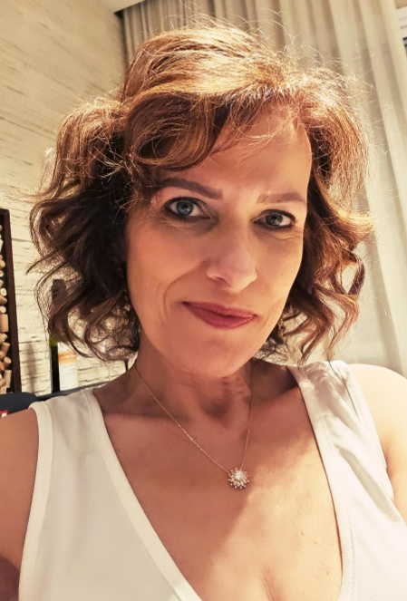
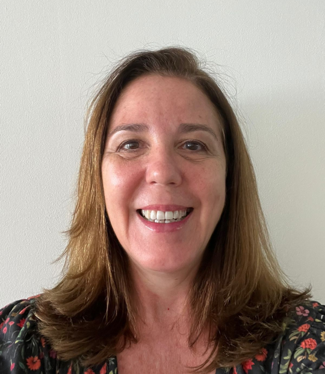

# [**Blog**]{style="color:darkgreen"}

## [**Members of the Lab R Group**]{style="color:darkgreen"}

<br>

```{css, echo=FALSE}
hr {
  border: none;
  border-top: 2px solid black;
  color: black;
  overflow: visible;
  text-align: justify;
  text-indent: 30px;
  line-height: 1.8;
}
```

### [**Alan Carvalho Dias**]{style="color:darkblue"}

{width="182"}

-   Master's degree in Health Science from the University of Brasília (UnB), Brazil.

-   MBA in Data Science and Analytics from the Luiz de Queiroz College of Agriculture, University of São Paulo (Esalq/USP), Brazil.

-   MBA in Project Management from the Getulio Vargas Foundation (FGV), Brazil.

-   Certified Lean Six Sigma Black Belt Specialist by Grupo Voitto, Brazil.

-   Pharmacist with a Bachelor's degree in Pharmacy and a qualification in Clinical Analysis from the Federal University of Juiz de Fora (UFJF), Brazil.

**Lindedin:** <a href="https://www.linkedin.com/in/alancarvalhodias/"><i class="fab fa-linkedin fa-2x"></i></a>

------------------------------------------------------------------------

### [**Claudia Maria Meira Dias**]{style="color:darkblue"}

{width="162"}

-   Author of the book “156 Questions and Answers – Quality in Clinical Laboratories” (Sarvier, 2012).

-   MBA in Business Management from the School of Business Administration of São Paulo, Getúlio Vargas Foundation (EAESP/FGV), Brazil. 

-   Specialization in Hospital Administration and Health Systems from the School of Business Administration of São Paulo, Getúlio Vargas Foundation (EAESP/FGV), Brazil. 

-   Bachelor's degree in Medicine from the Federal University of Juiz de Fora (UFJF) with medical residency in clinical medicine and clinical pathology from the Santa Casa de Misericórdia de São Paulo, Brazil.

**Lindedin:** <a href="https://www.linkedin.com/in/draclaudiameira/"><i class="fab fa-linkedin fa-2x"></i></a>

------------------------------------------------------------------------

### [**Derliane de Oliveira**]{style="color:darkblue"}

{width="209"}

-   Master´s degree in Science with emphasis on Quality Management from the Catholic University Santa María La Antigua of Panama (USMA), Panama.

-   MBA in Total Quality Management from the Fluminense Federal University (UFF), Brazil.

-   Pharmacist with a Bachelor's degree in Pharmacy with a qualification in Clinical Analysis from the State University of Londrina (UEL), Brazil.

**Lindedin:** <a href="https://www.linkedin.com/in/derlianedeoliveira/"><i class="fab fa-linkedin fa-2x"></i></a>

------------------------------------------------------------------------

### [**João Rodrigo Campos**]{style="color:darkblue"}

<br>

<br>

------------------------------------------------------------------------

### [**Luisane Maria Falci Vieira**]{style="color:darkblue"}

<br>

<br>

------------------------------------------------------------------------

### [**Tatiana Ferreira de Almeida**]{style="color:darkblue"}

<br>

<br>

<br>

<br>

<br>

<br>

<br>

<br>

<br>

<br>

<br>
